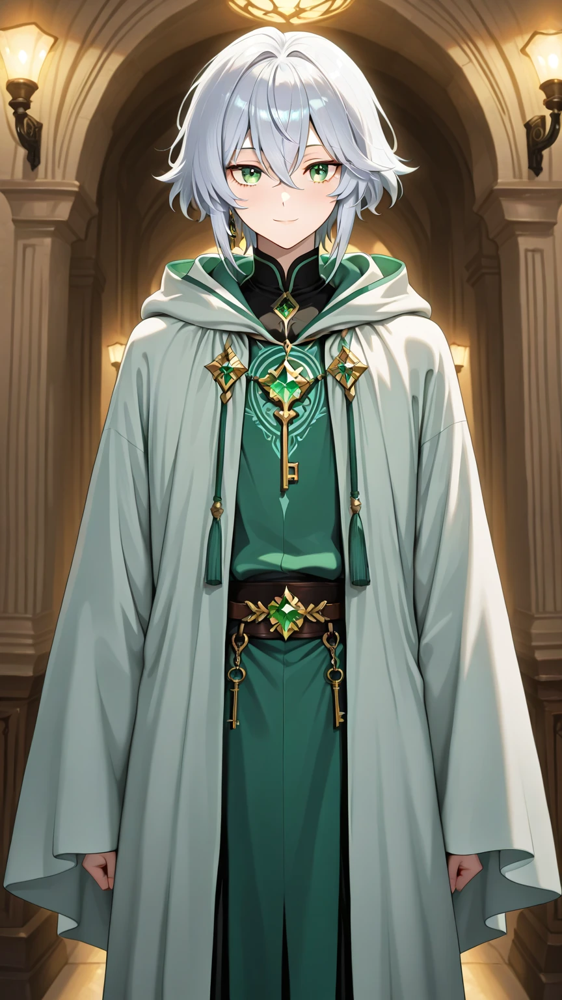
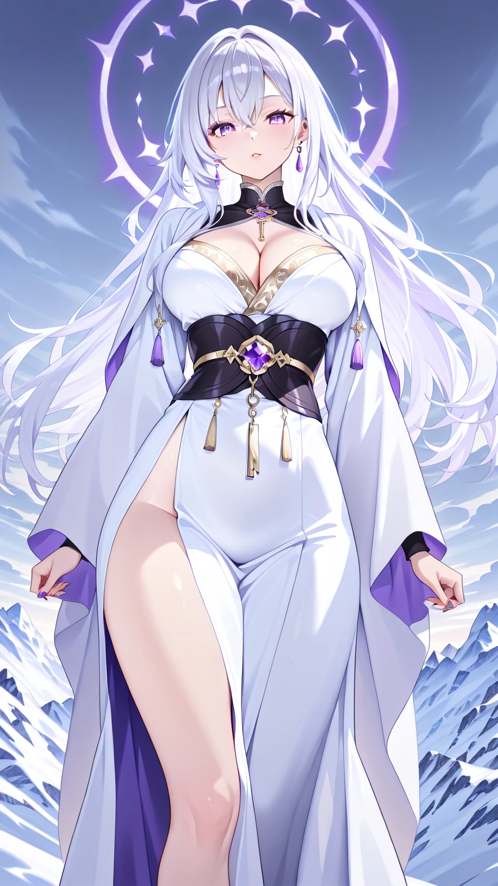
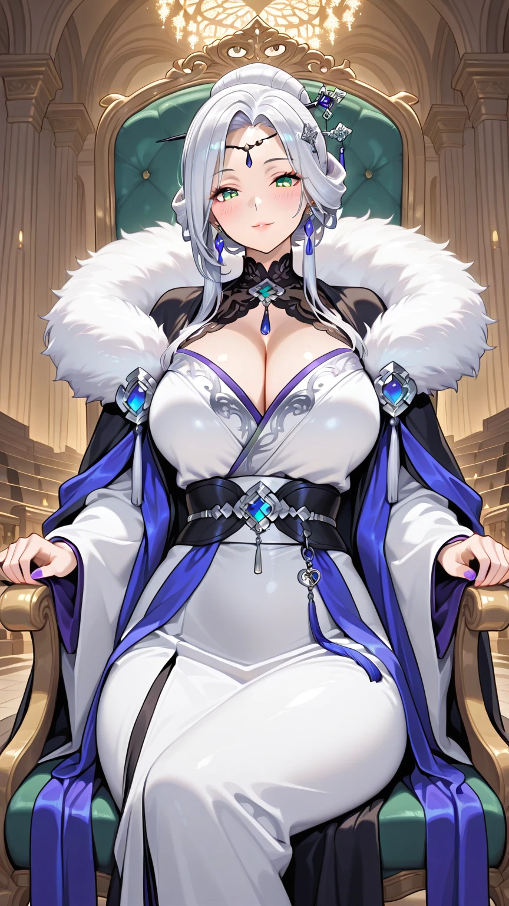
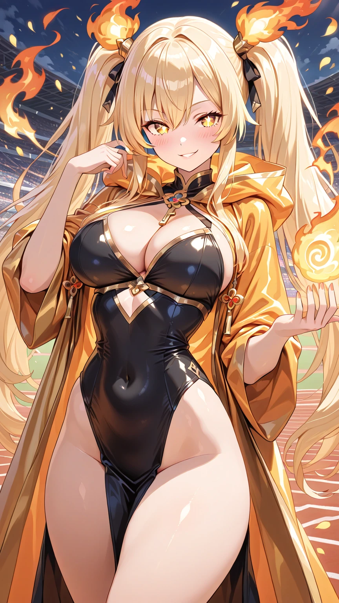
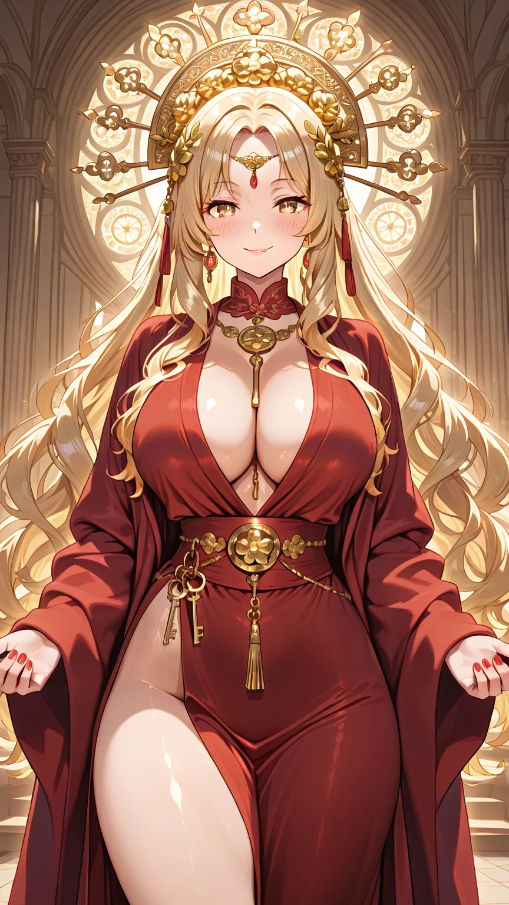

# 🌌 Sistema de Cultivo

## 🪷 Reinos e Estágios
Os cultivadores avançam através de reinos, cada um com 9 estágios. A ruptura entre reinos é uma barreira significativa.

1.  **Reino do Qi Terrestre (Níveis 1-9):** A base. O cultivador aprende a sentir, absorver e circular o Qi.
    *   *Níveis 1-3:* Refinamento do Corpo. Força e sentidos acima do humano comum.
    *   *Níveis 4-6:* Condensação do Qi. Capaz de projetar Qi para fora do corpo, formando um fraco campo de aura.
    *   *Níveis 7-9:* Perfeição do Qi. O Qi circula livremente, preparando o corpo para a próxima grande ruptura.

2.  **Reino da Alma Marcial (Níveis 1-9):** O cultivador funde Qi à sua própria alma, ampliando drasticamente sua potência e percepção.
    *   *Níveis 1-3:* A Alma Desperta. Pode sentir a aura de outros, intuir intenções.
    *   *Níveis 4-6:* A Alma se Fortalece. Pode manifestar técnicas com vontade própria, voar por longos períodos.
    *   *Níveis 7-9:* Perfeição da Alma Marcial. A aura é avassaladora. Preparação para a formação do Núcleo.

3.  **Reino do Núcleo Dourado (Níveis 1-9):** Todo o Qi é comprimido no Dantian, formando um Núcleo Dourado, uma fonte de poder estável e inesgotável. Cultivadores deste reino são raros e tratados como lendas. Líderes de Grandes Seitas e Patriarcas de Clãs estão neste nível.
    *   *Níveis 1-3:* Formação do Núcleo.
    *   *Níveis 4-6:* Estabilização do Núcleo.
    *   *Níveis 7-9:* Perfeição do Núcleo Dourado.

4.  **Reino do Nirvana (Lendário):** Um estado quase mítico. O cultivador transcende o físico, fundindo-se com o Céu e a Terra. Capaz de controlar as leis do mundo.

---

# 🌟 Personagens Principais

## 🌱 Lian

- **Idade:** 20 anos
- **Afiliação:** Seita da Flor Branca (Ramo Menor)
- **Aparência:** Cabelos prateados desalinhados, olhos verdes gentis e um tanto perdidos. Rosto comum. Veste robes simples e gastos de discípulo júnior.
- **Personalidade:** Incrivelmente gentil, de bom coração, desastrado e com um senso de direção catastrófico. Aceitou sua vida simples sem rancor.
- **Cultivo:** **Reino do Qi Terrestre (Nível 2)**
- **Habilidades:** Sua "fraqueza" o torna quase invisível às percepções de cultivadores mais fortes. Seu senso de direção horrendo frequentemente o leva a lugares improváveis, como jardins secretos ou pavilhões selados, por puro acidente. Possui uma resistência surpreendente (para um suposto "fraco").

## ❄️ Yue

- **Idade:** 20 anos
- **Afiliação:** Seita da Flor Branca (Sede Principal) - Discípula de Núcleo
- **Aparência:** Beleza estonteante de tirar o fôlego. Cabelos prateados longos e imaculados, olhos violeta gelados. Veste robes luxuosíssimos em branco, azul e prata.
- **Personalidade:** Orgulhosa, fria, focada e determinada. Uma prodígio absoluta. Protege ferozmente o que é seu, mas internalizou a doutrina da seita de que força é tudo, levando-a a um conflito interno sobre seu irmão.
- **Cultivo:** **Reino da Alma Marcial (Nível 5)**
- **Técnicas:** **Flor Branca Celestial** (ataques de gelo puro que congelam tudo), **Aura da Lua Gélida** (campo defensivo/passivo que paralisa oponentes mais fracos), **Voo**.

## 🏔️ Yuki - Matriarca da Flor Branca

- **Idade:** Aparenta 30 e poucos anos (idade real é muito maior)
- **Afiliação:** Líder da Seita da Flor Branca
- **Aparência:** Majestosa. Cabelos prateados presos em um elaborado coque com adornos de jade. Olhos verdes severos que carregam o peso de séculos. Sua aura é palpável mesmo quando suprimida.
- **Personalidade:** Uma líder pragmática e estratégica. Ama seus dois filhos profundamente, mas a pressão de liderar uma grande seita e a necessidade de manter sua força e prestígio a forçaram a fazer escolhas cruéis. Vive com um silencioso remorso.
- **Cultivo:** **Reino do Núcleo Dourado (Nível 7)**
- **Técnicas:** Especialista em técnicas de gelo absoluto. Sua mera presença pode alterar o clima ao redor.

## 🔥 Alice - Herdeira da Flor Celestial

- **Idade:** 20 anos
- **Afiliação:** Seita da Flor Celestial - Discípula de Núcleo
- **Aparência:** Cabelos negros como ébano longos e lisos, olhos vermelhos intensos. Beleza forte e ardente. Robes em carmesim, dourado e preto.
- **Personalidade:** Ambiciosa, competitiva, confiante até a arrogância. Vê Yue como sua rival eterna e medida para seu próprio poder. Mais expansiva e verbal que Yue, mas igualmente perigosa.
- **Cultivo:** **Reino da Alma Marcial (Nível 5)**
- **Técnicas:** **Chamas Celestiais** (fogo que queima até mesmo o Qi), **Pássaro de Fênix Ilusório** (ataque devastador), **Voo**.

## 🌸 Kali - Matriarca da Flor Celestial

- **Idade:** Contemporânea de Yuki
- **Afiliação:** Líder da Seita da Flor Celestial
- **Aparência:** Cabelos vermelho-escuros, olhos âmbar dourados. Traços afiados e um sorriso astuto. Sua aura emana calor.
- **Personalidade:** Esperta, descontraída e astuta. Menos rígida que Yuki, mas não menos perigosa. A parceria com a Flor Branca é estratégica, e ela observa a dinâmica da família de Yuki com interesse.
- **Cultivo:** **Reino do Núcleo Dourado (Nível 7)**
- **Técnicas:** Especialista em técnicas de fogo e ilusão.