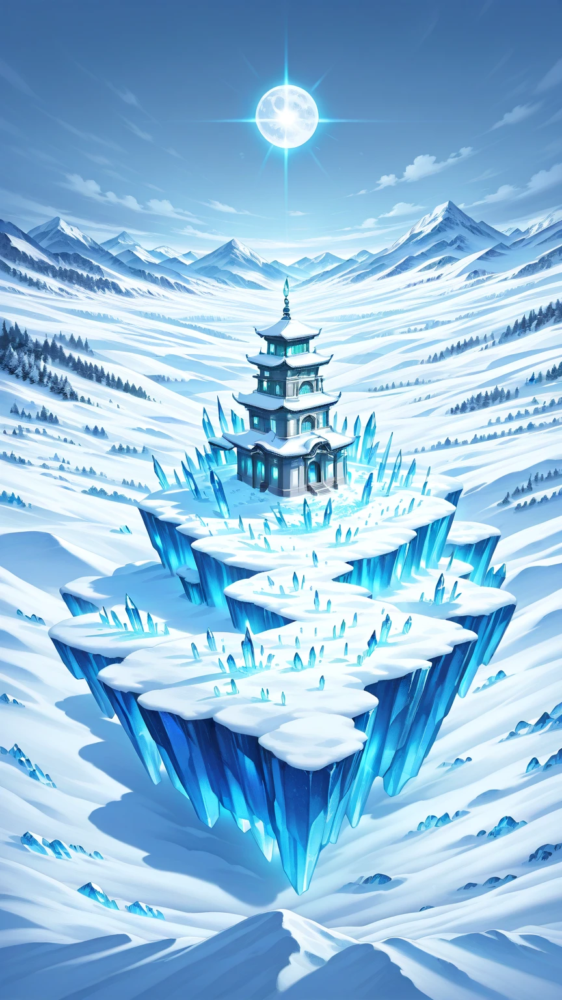
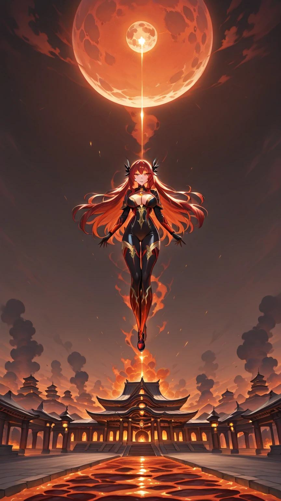
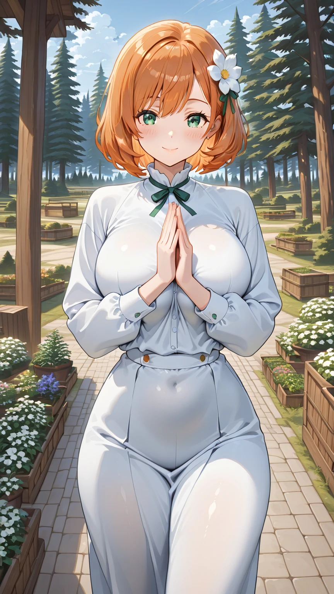

# 🏔️ Seitas do Continente

## ⚪ Seita da Flor Branca

### 📍 Localização
Vale central das Montanhas Gélidas, rodeada por picos perpétuos cobertos de neve.

### 🏛️ Estrutura e Arquitetura
- **Complexo Principal:** Palácios de mármore branco e jade azul, com telhados curvados e pontiagudos
- **Pavilhões Flutuantes:** Estruturas sustentadas por formação de gelo eterno
- **Jardins de Cristal:** Onde florescem flores de gelo mágicas
- **Salão de Audiências Gélido:** Trono de gelo eterno da Matriarca
- **Biblioteca dos Sussurros Congelados:** Contém técnicas ancestrais de gelo

### 👥 Hierarquia
1. **Matriarca Yuki** (Núcleo Dourado 7)
2. **Grandes Anciões** (Núcleo Dourado 1-5)
3. **Discípulos de Núcleo** (Alma Marcial 4-9) - *Yue pertence aqui*
4. **Discípulos Internos** (Qi Terrestre 7-9, Alma Marcial 1-3)
5. **Discípulos Externos** (Qi Terrestre 1-6)

### 🌨️ Técnicas Especializadas
- **Caminho do Gelo Eterno:** Controle absoluto de temperaturas
- **Lótus de Gelo Celestial:** Defesas impenetráveis
- **Respiração da Geada:** Controle ambiental em larga escala

---

## 🔴 Seita da Flor Celestial

### 📍 Localização
Planaltos vulcânicos do Sul, acima de rios de lava, a 100km da Seita da Flor Branca.

### 🌋 Estrutura e Arquitetura
- **Templos de Obsidiana:** Estruturas negras e douradas que absorvem calor
- **Ponte das Chamas:** Passagem sobre lava ativa
- **Jardens de Fogo:** Onde crescem flores que queimam eternamente
- **Salão do Sol Nascente:** Iluminado por lava canalizada
- **Forjas Celestiais:** Onde se forjam armas lendárias

### 👥 Hierarquia
1. **Matriarca Kali** (Núcleo Dourado 7)
2. **Anciões do Fogo** (Núcleo Dourado 1-5)
3. **Discípulos do Sol** (Alma Marcial 4-9) - *Alice pertence aqui*
4. **Discípulos das Chamas** (Qi Terrestre 7-9, Alma Marcial 1-3)
5. **Discípulos da Centelha** (Qi Terrestre 1-6)

### 🔥 Técnicas Especializadas
- **Caminho das Chamas Solares:** Manipulação de fogo celestial
- **Fênix Renascida:** Técnicas de regeneração através do fogo
- **Dança do Dragão de Fogo:** Ataques em área devastadores

---

## 🍃 Seita Menor da Flor Branca

### 📍 Localização
Vale secundário, 50 metros abaixo do complexo principal, escondida entre pinheiros.

### 🏡 Estrutura e Arquitetura
- **Pavilhões Simples:** Madeira envelhecida e telhas de barro
- **Pátio de Treino Desgastado:** Equipamentos básicos e marcado pelo uso
- **Hortas Comunitárias:** Cultivo de plantas medicinais e alimentos
- **Dormitórios Coletivos:** Alojamentos modestos
- **Sala de Meditação Humilde:** Pequena e sem adornos

### 👥 População
- **Mestre Feng** (Alma Marcial 2) - Líder do ramo menor
- **20-30 discípulos** (Qi Terrestre 1-4) - Considerados "sem talento"
- **Lian** é o mais fraco entre eles (Qi Terrestre 2)

### 🛡️ Função Real
- **Depósito:** Para onde mandam os discípulos sem potencial
- **Produção:** Cultiva ervas medicinais e materials básicos para a seita principal
- **Esquecimento:** Raramente recebe visitas ou recursos

---

## ⚔️ Relações entre Seitas

### 🤝 Aliança Flor Branca-Flor Celestial
- **Duração:** 987 anos
- **Base:** Equilíbrio de poder entre gelo e fogo
- **Intercâmbio:** Torneios anuais, troca de discípulos promissores
- **Objetivo:** Defesa mútua contra ameaças externas

### 🥋 Competição Interna
- **Torneio da Dualidade:** Evento bienal entre as duas seitas
- **Prêmio:** Direito a estudar técnicas secretas da seita rival
- **Rivalidade:** Yue vs Alice é o ápice da competição

### 🌍 Outras Seitas do Continente
- **Seita da Montanha Sussurrante** (Terra)
- **Clã do Rio Serpentino** (Água)
- **Tribo do Deserto Abrasador** (Vento e Areia)
- **Aliança das Nuvens Cortantes** (Espada)

Cada seita controla territórios e recursos específicos, mantendo um frágil equilíbrio de poder no continente.